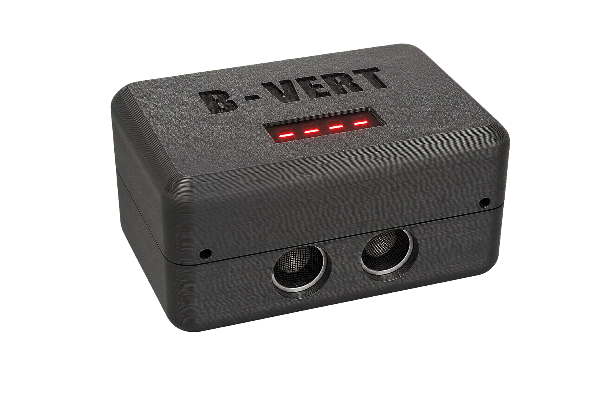
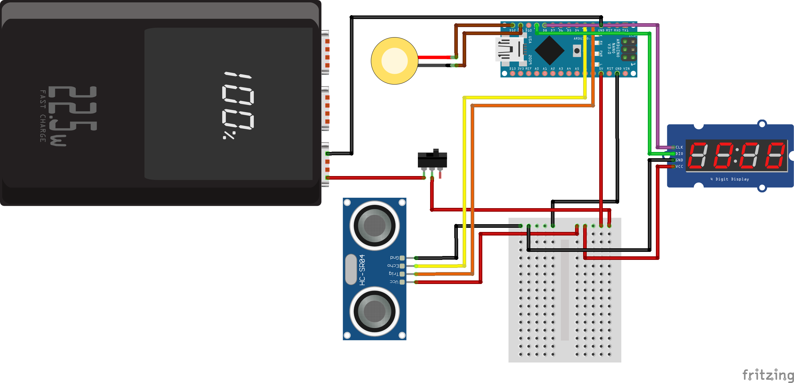

# B-VERT — Medidor de salto vertical

Sistema electrónico portátil que mide y muestra altura de un salto vertical en tiempo real basado en un Arduino Nano y mediante un sensor ultrasónico

  

  

  

## Descripción

B-VERT detecta el despegue y el aterrizaje de una persona mediante un sensor ultrasónico. A partir del tiempo durante el cual la persona permanece en el aire, calcula la altura alcanzada y muestra el resultado en un display de cuatro dígitos.

El proyecto integra diseño electrónico, programación de sistemas embebidos y diseño mecánico mediante impresión 3D.

## Características principales

- Medición sin contacto mediante un sensor ultrasónico HC-SR04.
- Procesamiento realizado con un Arduino Nano.
- Visualización mediante un display TM1637 de cuatro dígitos.
- Avisos sonoros mediante una membrana piezoeléctrica.
- Alimentación portátil mediante una power bank.
- Encendido y apagado mediante un interruptor general.
- Carcasa diseñada y fabricada mediante impresión 3D.

## Funcionamiento

1. El sistema comprueba que la persona se encuentre correctamente posicionada.
2. El sensor ultrasónico realiza mediciones periódicas.
3. La ausencia de la persona durante varias mediciones confirma el inicio del salto.
4. Su reaparición confirma el aterrizaje.
5. El tiempo de vuelo se utiliza para calcular la altura.
6. El resultado se presenta en el display.

La altura se calcula mediante:

\[
h = \frac{g t^2}{8}
\]

donde `t` es el tiempo total de vuelo y `g` es la aceleración de la gravedad.

## Componentes electrónicos

- Arduino Nano.
- Sensor ultrasónico HC-SR04.
- Display de cuatro dígitos con controlador TM1637.
- Membrana piezoeléctrica pasiva.
- Interruptor de encendido.
- Power bank de 5 V.
- Placa experimental y cableado.

## Diagrama de conexiones

  

  

- [Ver esquema en PDF](Hardware/Esquema_B-VERT.pdf)
- [Abrir proyecto de Fritzing](Hardware/Esquema_B-VERT.fzz)

## Firmware

El firmware implementa una máquina de estados para identificar la preparación, el despegue, el tiempo de vuelo y el aterrizaje. También filtra mediciones erróneas y evita que rebotes aislados del sensor sean interpretados como un salto.

[Ver código fuente](Firmware/B_VERT_V4.ino)

## Diseño mecánico

La carcasa fue diseñada mediante AutoDesk Fusion 360 y fabricada mediante impresión 3D.

  

## Autor

Proyecto diseñado y desarrollado por Baltazar Patané.