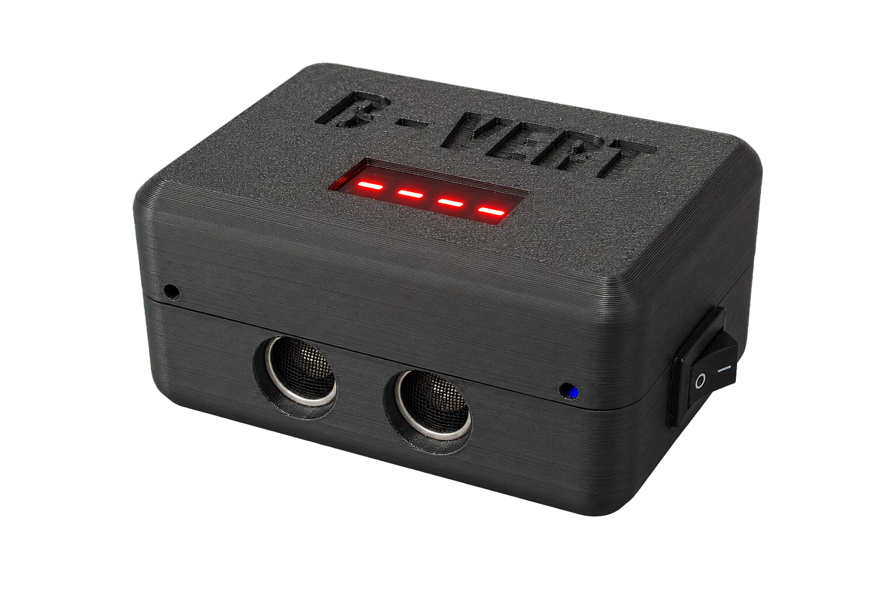
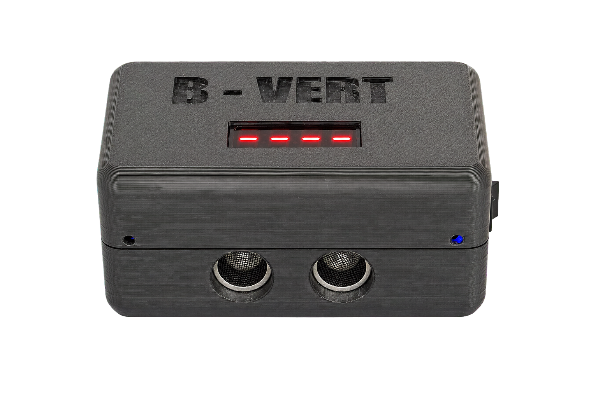
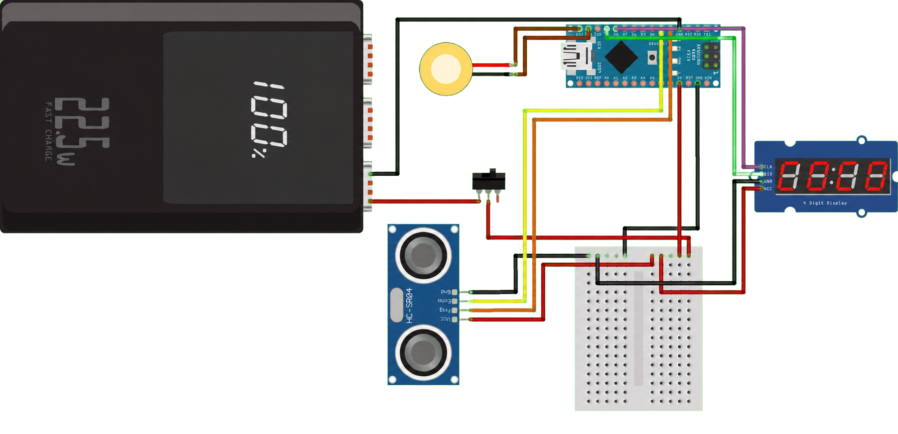
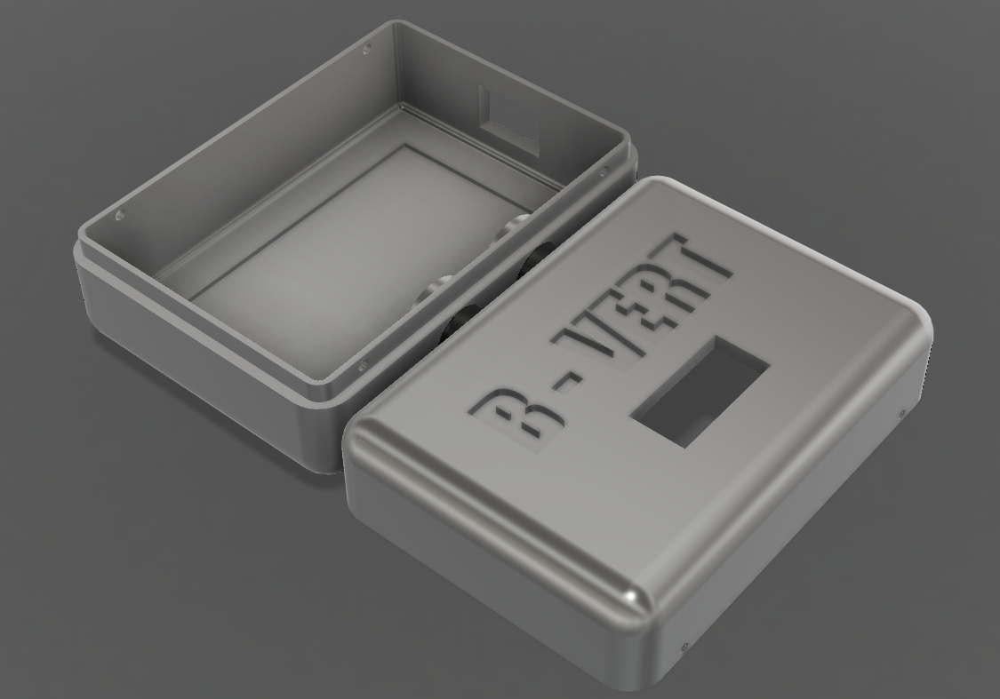

<h1 align="center">B-VERT</h1>

&emsp; 

<h3 align="center">Medidor portátil de salto vertical</h3>

  <strong>Electrónica embebida · Medición ultrasónica · Diseño e impresión 3D</strong>

  
  
  
  

&emsp; 

  
  

## Descripción general

&emsp; **B-VERT** es un sistema electrónico portátil diseñado para medir la altura de un salto vertical de manera automática y sin contacto. Un sensor ultrasónico detecta el despegue y el aterrizaje del usuario, mientras que un **Arduino Nano** procesa el tiempo total de vuelo y calcula la altura alcanzada. El resultado se presenta inmediatamente en un display de cuatro dígitos y se acompaña con señales sonoras que indican las distintas etapas de la medición. El firmware utiliza una **máquina de estados**, medición por **interrupciones** y múltiples validaciones para distinguir un salto real de lecturas aisladas o erróneas. El proyecto integra electrónica, programación de sistemas embebidos, modelado CAD y fabricación mediante impresión 3D en un único dispositivo compacto.

> La lógica de B-VERT no toma decisiones a partir de una sola lectura: cada transición importante debe cumplir condiciones temporales y acumular mediciones consecutivas coherentes.

&emsp; 

## Componentes electrónicos

| Componente | Función dentro del sistema |
| --- | --- |
| **Arduino Nano** | Ejecuta la máquina de estados, procesa las mediciones y calcula la altura. |
| **HC-SR04** | Detecta la presencia o ausencia del usuario mediante ultrasonido. |
| **Display TM1637** | Muestra indicaciones, animaciones y la altura calculada. |
| **Membrana piezoeléctrica pasiva** | Genera las señales sonoras de inicio y finalización. |
| **Interruptor general** | Conecta o interrumpe la alimentación del dispositivo. |
| **Power bank de 5 V** | Proporciona una fuente de energía portátil y recargable. |
| **Placa experimental y cableado** | Interconectan y distribuyen la alimentación entre los módulos. |

&emsp; 

## Diagrama de conexiones

  

La documentación del hardware se encuentra disponible en los siguientes formatos:

- [Ver esquema eléctrico en PDF](Hardware/Esquema_B-VERT.pdf)
- [Abrir el proyecto editable de Fritzing](Hardware/Esquema_B-VERT.fzz)

&emsp; 

## Diseño mecánico e impresión 3D

&emsp; La carcasa de B-VERT fue modelada en **Autodesk Fusion 360** y fabricada mediante impresión 3D. Su froma consiste en una caja rectangular compacta de bordes y esquinas redondeados, pensada para proteger la electrónica y facilitar el transporte y la manipulación del equipo.

&emsp; El diseño está dividido de forma horizontal en dos tapas encastrables. Además, en la cara frontal se incorporaron dos aberturas circulares para el emisor y el receptor del HC-SR04, manteniendo los transductores expuestos sin dejar desprotegido el resto del circuito La superficie superior incluye un corte rectangular para el display de cuatro dígitos y el nombre **B-VERT** integrado en la propia pieza, mientras que en uno de los laterales se agregó el recorte para el interruptor de encendido y apagado.

&emsp; 

  

&emsp; 

## Funcionamiento

&emsp; Al encenderse, B-VERT ejecuta una etapa de inicialización en la que comprueba que el sensor entregue valores válidos y que la persona esté ubicada dentro del rango previsto. Una vez completada esta verificación, el display indica que el equipo está listo y una señal sonora habilita el inicio del salto. Desde ese momento, el sensor ultrasónico realiza mediciones periódicas y el firmware analiza la continuidad de esas lecturas.

&emsp; El despegue no se confirma ante una única pérdida de señal. El sistema exige una secuencia sostenida de mediciones que indiquen la ausencia de la persona y conserva el instante de la primera lectura válida de esa secuencia como comienzo del vuelo. De forma equivalente, el aterrizaje solo se acepta cuando varias lecturas consecutivas vuelven a confirmar su presencia. Esta estrategia evita que un rebote, una reflexión deficiente o un pulso aislado del sensor sean interpretados como un salto completo.

&emsp; Cuando se confirma el aterrizaje, el tiempo transcurrido entre ambos eventos se utiliza para calcular la altura. El resultado final se muestra en el display y se acompaña con un aviso sonoro; luego de un breve intervalo, el sistema reinicia automáticamente el ciclo y queda preparado para una nueva medición.

&emsp; La altura se obtiene mediante la ecuación del movimiento vertical (donde **$t$** es el tiempo total de vuelo y **$g$** es la aceleración de la gravedad):

$$
h = \frac{g \cdot t^2}{8}
$$

&emsp; 

### Máquina de estados

| Estado | Responsabilidad |
| --- | --- |
| **`REINICIANDO`** | Restablece variables y contadores, ejecuta la animación inicial y valida la posición del usuario. |
| **`LISTO`** | Supervisa las mediciones y espera una ausencia sostenida que permita confirmar el despegue. |
| **`CONTANDO`** | Cronometra el tiempo de vuelo, actualiza la estimación en pantalla y espera la confirmación del aterrizaje. |
| **`TERMINADO`** | Calcula y muestra la altura definitiva, reproduce el aviso sonoro y prepara un nuevo ciclo. |

> Esta separación hace que el comportamiento sea **determinista y fácil de mantener**
&emsp; 

### Medición mediante interrupciones

&emsp; Durante el funcionamiento normal, la duración del pulso `ECHO` del HC-SR04 se captura mediante una **interrupción por cambio de estado** en el pin D3. En el flanco ascendente, la rutina registra el instante de inicio con `micros()`; en el flanco descendente, calcula la duración total del pulso y marca la disponibilidad de una nueva medición. De esta manera, el microcontrolador puede continuar atendiendo la máquina de estados, el display y las señales sonoras sin permanecer bloqueado esperando la respuesta del sensor.

&emsp; Las variables compartidas entre la interrupción y el programa principal se declaran como `volatile`. Además, el firmware deshabilita brevemente las interrupciones al copiar o reiniciar esos datos, creando secciones críticas que evitan lecturas parciales o inconsistentes.

&emsp; 

##

&emsp; 

  Proyecto diseñado y desarrollado por <strong>Baltazar Patané</strong>.

&emsp; 